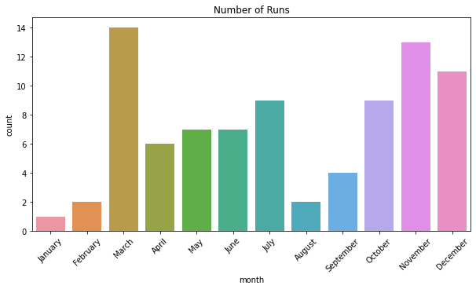
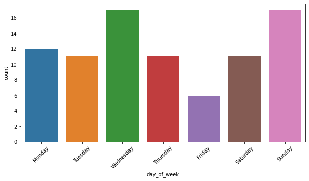

```python
import pandas as pd
import matplotlib.pyplot as plt
import seaborn as sns
```


```python
data = pd.read_csv('/.../Runkeeper/runkeeper.csv')
```


```python
data.head(5)
```


<div>
<table border="1" class="dataframe">
  <thead>
    <tr style="text-align: right;">
      <th></th>
      <th>Activity Id</th>
      <th>Date</th>
      <th>Type</th>
      <th>Route Name</th>
      <th>Distance (km)</th>
      <th>Duration</th>
      <th>Average Pace</th>
      <th>Average Speed (km/h)</th>
      <th>Calories Burned</th>
      <th>Climb (m)</th>
      <th>Average Heart Rate (bpm)</th>
      <th>Friend's Tagged</th>
      <th>Notes</th>
      <th>GPX File</th>
    </tr>
  </thead>
  <tbody>
    <tr>
      <th>0</th>
      <td>c472d0ca-8622-4a07-9e93-51b74e1660f8</td>
      <td>2021-02-01 20:26:25</td>
      <td>Running</td>
      <td>NaN</td>
      <td>6.25</td>
      <td>46:06</td>
      <td>7:23</td>
      <td>8.13</td>
      <td>329.0</td>
      <td>86</td>
      <td>NaN</td>
      <td>NaN</td>
      <td>NaN</td>
      <td>2021-02-01-202625.gpx</td>
    </tr>
    <tr>
      <th>1</th>
      <td>a4bd339e-0159-4d62-8603-c5d87e5d1779</td>
      <td>2021-01-29 13:31:14</td>
      <td>Running</td>
      <td>NaN</td>
      <td>2.61</td>
      <td>20:49</td>
      <td>8:00</td>
      <td>7.51</td>
      <td>131.0</td>
      <td>18</td>
      <td>NaN</td>
      <td>NaN</td>
      <td>NaN</td>
      <td>2021-01-29-133114.gpx</td>
    </tr>
    <tr>
      <th>2</th>
      <td>ff073441-9acb-4de8-b719-c9f294604985</td>
      <td>2021-01-28 19:59:18</td>
      <td>Running</td>
      <td>NaN</td>
      <td>7.01</td>
      <td>52:31</td>
      <td>7:30</td>
      <td>8.00</td>
      <td>365.0</td>
      <td>108</td>
      <td>NaN</td>
      <td>NaN</td>
      <td>NaN</td>
      <td>2021-01-28-195918.gpx</td>
    </tr>
    <tr>
      <th>3</th>
      <td>8fa3c86e-fbca-49ea-9925-89975057207c</td>
      <td>2021-01-27 19:57:59</td>
      <td>Running</td>
      <td>NaN</td>
      <td>8.01</td>
      <td>1:03:08</td>
      <td>7:53</td>
      <td>7.61</td>
      <td>407.0</td>
      <td>119</td>
      <td>NaN</td>
      <td>NaN</td>
      <td>NaN</td>
      <td>2021-01-27-195759.gpx</td>
    </tr>
    <tr>
      <th>4</th>
      <td>f5b66ddb-ec0d-45d5-b68f-3261bd053f6b</td>
      <td>2021-01-25 16:24:09</td>
      <td>Running</td>
      <td>NaN</td>
      <td>5.02</td>
      <td>36:04</td>
      <td>7:11</td>
      <td>8.34</td>
      <td>259.0</td>
      <td>46</td>
      <td>NaN</td>
      <td>NaN</td>
      <td>NaN</td>
      <td>2021-01-25-162409.gpx</td>
    </tr>
  </tbody>
</table>
</div>


```python
data.rename(columns={"Friend's Tagged":'Friend','Distance (km)':'Distance_km'}, inplace=True)
```


```python
data.drop(['Activity Id','Type','Route Name','Average Heart Rate (bpm)','Friend','Notes','GPX File','Average Pace'], axis=1, inplace= True)
```


```python
data.columns = data.columns.str.lower() # bring columns'names to lower case
```


```python
data.info()
```

    <class 'pandas.core.frame.DataFrame'>
    RangeIndex: 110 entries, 0 to 109
    Data columns (total 6 columns):
     #   Column                Non-Null Count  Dtype  
    ---  ------                --------------  -----  
     0   date                  110 non-null    object 
     1   distance_km           110 non-null    float64
     2   duration              110 non-null    object 
     3   average speed (km/h)  110 non-null    float64
     4   calories burned       110 non-null    float64
     5   climb (m)             110 non-null    int64  
    dtypes: float64(3), int64(1), object(2)
    memory usage: 5.3+ KB


### Duration 


```python
minutes = []
for i in data['duration'].str.split(':'):
    if len(i) == 3:
        a = round(int(i[0])*60 + int(i[1]) + int(i[2]) / 60, 2)
        minutes.append(a)

    if len(i) == 2:
        a = round(int(i[0]) + int(i[1]) / 60, 2)
        minutes.append(a)

data.insert(2,'duration_min',minutes) # insert a new column
data.drop('duration', axis=1, inplace=True) # del original duration column
```

### Date


```python
data['date'] = pd.to_datetime(data['date']) # bring object to datetime format

data['date_round'] = data['date'].dt.round('30Min') 

data['day'] = [d.date() for d in data['date_round']] # returns date form datetime
data['time'] = [d.time() for d in data['date_round']] # returns time form datetime

data['or_day'] = data['date_round'].dt.day # returns ordinal day in month
data['year'] = data['date_round'].dt.year # returns year
data['day_of_week'] = data['date_round'].dt.day_name() # returns name of the day
data['month'] = data['date_round'].dt.month_name() # returns name of the month

data['quarter'] = data['date_round'].dt.quarter # returns ordinal number of quarter

data.drop(['date_round', 'date'], axis = 1, inplace=True)
```


```python
def season(name):
    if name in ['December','January','February']:
        return 'winter'
    if name in ['March','April','May']:
        return 'spring'
    if name in ['June','July','August']:
        return 'summer'
    if name in ['September','October','November']:
        return 'autumn'
    
```


```python
data['season'] = data['month'].apply(season)
```


```python
cols = data.columns.tolist() # list of columns
cols = cols[-8:] + cols[:-8] # move date columns infront 
data = data[cols] 
```


```python
data.info()
```

    <class 'pandas.core.frame.DataFrame'>
    RangeIndex: 110 entries, 0 to 109
    Data columns (total 13 columns):
     #   Column                Non-Null Count  Dtype  
    ---  ------                --------------  -----  
     0   day                   110 non-null    object 
     1   time                  110 non-null    object 
     2   or_day                110 non-null    int64  
     3   year                  110 non-null    int64  
     4   day_of_week           110 non-null    object 
     5   month                 110 non-null    object 
     6   quarter               110 non-null    int64  
     7   season                110 non-null    object 
     8   distance_km           110 non-null    float64
     9   duration_min          110 non-null    float64
     10  average speed (km/h)  110 non-null    float64
     11  calories burned       110 non-null    float64
     12  climb (m)             110 non-null    int64  
    dtypes: float64(4), int64(4), object(5)
    memory usage: 11.3+ KB


```python
data.head()
```


<div>
<table border="1" class="dataframe">
  <thead>
    <tr style="text-align: right;">
      <th></th>
      <th>day</th>
      <th>time</th>
      <th>or_day</th>
      <th>year</th>
      <th>day_of_week</th>
      <th>month</th>
      <th>quarter</th>
      <th>season</th>
      <th>distance_km</th>
      <th>duration_min</th>
      <th>average speed (km/h)</th>
      <th>calories burned</th>
      <th>climb (m)</th>
    </tr>
  </thead>
  <tbody>
    <tr>
      <th>0</th>
      <td>2021-02-01</td>
      <td>20:30:00</td>
      <td>1</td>
      <td>2021</td>
      <td>Monday</td>
      <td>February</td>
      <td>1</td>
      <td>winter</td>
      <td>6.25</td>
      <td>46.10</td>
      <td>8.13</td>
      <td>329.0</td>
      <td>86</td>
    </tr>
    <tr>
      <th>1</th>
      <td>2021-01-29</td>
      <td>13:30:00</td>
      <td>29</td>
      <td>2021</td>
      <td>Friday</td>
      <td>January</td>
      <td>1</td>
      <td>winter</td>
      <td>2.61</td>
      <td>20.82</td>
      <td>7.51</td>
      <td>131.0</td>
      <td>18</td>
    </tr>
    <tr>
      <th>2</th>
      <td>2021-01-28</td>
      <td>20:00:00</td>
      <td>28</td>
      <td>2021</td>
      <td>Thursday</td>
      <td>January</td>
      <td>1</td>
      <td>winter</td>
      <td>7.01</td>
      <td>52.52</td>
      <td>8.00</td>
      <td>365.0</td>
      <td>108</td>
    </tr>
    <tr>
      <th>3</th>
      <td>2021-01-27</td>
      <td>20:00:00</td>
      <td>27</td>
      <td>2021</td>
      <td>Wednesday</td>
      <td>January</td>
      <td>1</td>
      <td>winter</td>
      <td>8.01</td>
      <td>63.13</td>
      <td>7.61</td>
      <td>407.0</td>
      <td>119</td>
    </tr>
    <tr>
      <th>4</th>
      <td>2021-01-25</td>
      <td>16:30:00</td>
      <td>25</td>
      <td>2021</td>
      <td>Monday</td>
      <td>January</td>
      <td>1</td>
      <td>winter</td>
      <td>5.02</td>
      <td>36.07</td>
      <td>8.34</td>
      <td>259.0</td>
      <td>46</td>
    </tr>
  </tbody>
</table>
</div>


### Some statistics


```python
print('Data contains years :', data['year'].unique().tolist())
```

    Data contains years : [2021, 2020, 2019]


```python
#  Only 2020
data_20 = data.query('year == 2020')

print('Total number of runs:',data_20['or_day'].count())
print('Total distance:',data_20['distance_km'].sum().round(2))
print('Total calories burn:',data_20['calories burned'].sum())
print('Average speed:',data_20['average speed (km/h)'].mean())

```

    Total number of runs: 85
    Total distance: 405.06
    Total calories burn: 20626.0
    Average speed: 7.743764705882355


```python
# Frequency by seasons
data_20.groupby('season')['or_day'].sum().sort_values(ascending=False)
```


    season
    autumn    445
    spring    421
    summer    271
    winter    197
    Name: or_day, dtype: int64


```python
# Distance by seasons
data_20.groupby('season')['distance_km'].sum().sort_values(ascending=False)
```


    season
    spring    137.64
    autumn    122.83
    summer     73.62
    winter     70.97
    Name: distance_km, dtype: float64


```python
# Average run by seasons
data_20.groupby('season')['distance_km'].mean().sort_values(ascending=False)
```


    season
    spring    5.097778
    winter    5.069286
    autumn    4.724231
    summer    4.090000
    Name: distance_km, dtype: float64


```python
# Most popular months
data_20.groupby('month')['or_day'].count().sort_values(ascending=False)
```


    month
    March        14
    November     13
    December     11
    October       9
    July          9
    May           7
    June          7
    April         6
    September     4
    February      2
    August        2
    January       1
    Name: or_day, dtype: int64


```python
data_20.groupby('month')['distance_km'].sum().sort_values(ascending=False)
```


    month
    March        77.69
    November     68.10
    December     54.97
    July         39.11
    October      37.38
    April        30.09
    May          29.86
    June         25.64
    September    17.35
    August        8.87
    February      8.69
    January       7.31
    Name: distance_km, dtype: float64


```python
plt.figure(figsize =(10, 5))
ax = sns.countplot(x="month",data=data_20,\
            order = ['January','February','March','April','May','June','July','August','September',\
                    'October','November','December'])
plt.xticks(rotation = 45)
ax.set_title('Number of Runs')
plt.show()
```


    

    


```python
data_km = data_20.groupby('month').sum()
data_km.reset_index(inplace=True)
```


```python
plt.figure(figsize =(10, 5))
ax = sns.countplot(x="day_of_week",data=data_20,\
              order = ['Monday','Tuesday', 'Wednesday','Thursday','Friday','Saturday','Sunday'],\
             orient = 'h')
plt.xticks(rotation = 45)
```


    (array([0, 1, 2, 3, 4, 5, 6]),
     [Text(0, 0, 'Monday'),
      Text(1, 0, 'Tuesday'),
      Text(2, 0, 'Wednesday'),
      Text(3, 0, 'Thursday'),
      Text(4, 0, 'Friday'),
      Text(5, 0, 'Saturday'),
      Text(6, 0, 'Sunday')])


    

    


### Saving dataframe to csv


```python
data_20.to_csv('/.../Runkeeper/rundata2020.csv')
```
